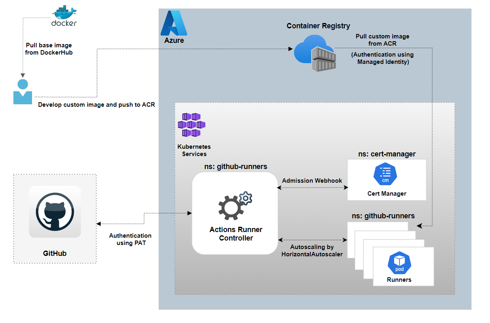
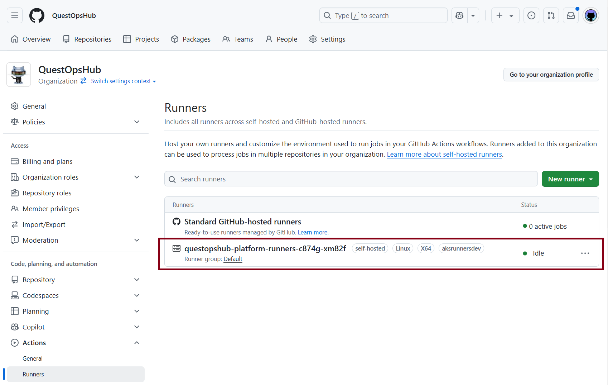

# Self-Hosted GitHub Runners on Azure Kubernetes Service (AKS)

This repository enables the deployment and management of self-hosted GitHub runners on Azure Kubernetes Service (AKS), offering a scalable, private, and customizable solution for CI/CD workflows.

## 🏗 Architecture

- 

## 🎯 End Result

- As shown in the below diagram, runners will be added at the organizational level through a structured and scalable integration process. This approach allows runners to be dynamically assigned based on real-time workload demands, optimizing performance and minimizing downtime.

    - 

## 🤝 Contributing

- Contributions are welcome! Please open issues or submit pull requests for improvements and fixes.

## 📄 License

- This project is licensed under the MIT License.